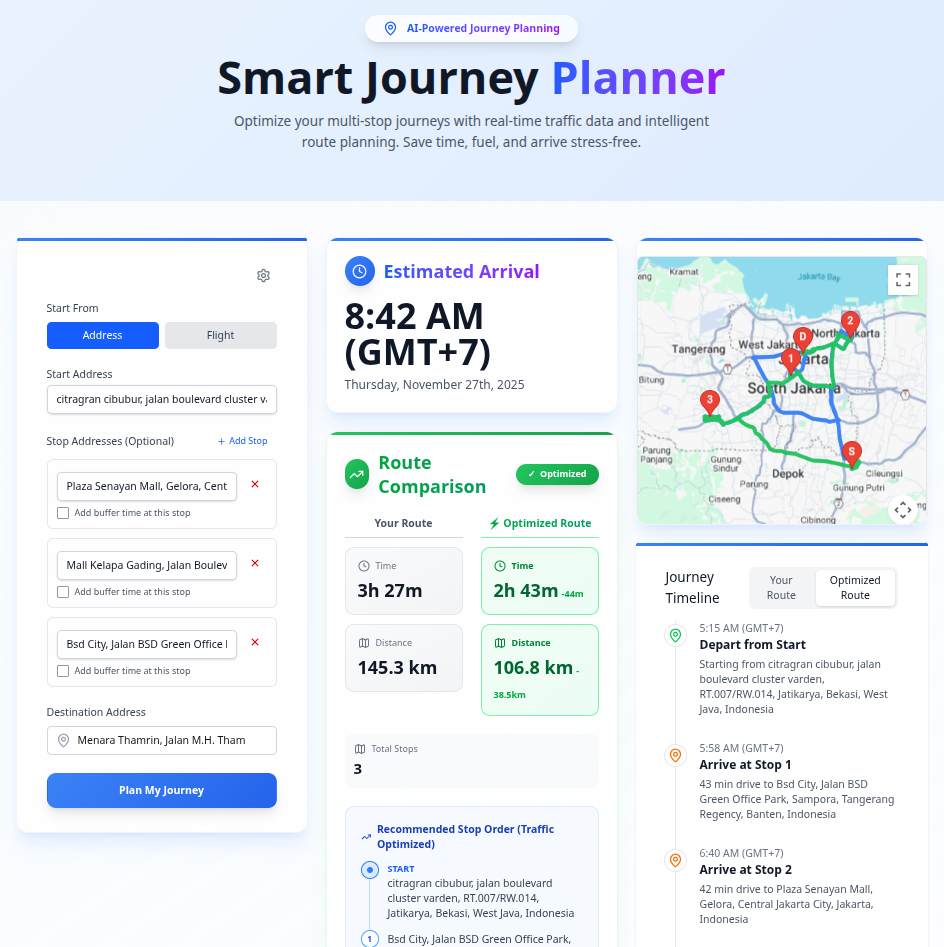

# Smart Journey Planner

A comprehensive, AI-powered travel planning application built with Next.js 16. This application helps users plan their journeys by integrating multi-modal routing, intelligent stop management, and AI-driven travel advice.



[](https://opensource.org/licenses/MIT)
[](https://nextjs.org/)
[](https://www.typescriptlang.org/)

<!--  -->
<!-- *You might want to add a screenshot here later* -->

## 📋 Table of Contents

- [Features](#-features)
- [Tech Stack](#-tech-stack)
- [Project Structure](#-project-structure)
- [Getting Started](#-getting-started)
  - [Prerequisites](#prerequisites)
  - [Installation](#installation)
  - [Running the Application](#running-the-application)
- [Usage](#-usage)
- [Contributing](#-contributing)
- [License](#-license)
- [Acknowledgments](#-acknowledgments)
- [Contact](#-contact)

## 🚀 Features

- **Multi-Modal Routing**: Support for starting journeys from a specific address or a flight arrival.
- **Interactive Maps**:
  - **Google Maps**: Full integration for geocoding, autocomplete, and routing (Recommended).
  - **Mapbox**: Alternative map provider support.
  - **OpenStreetMap**: Free, open-source map alternative using Leaflet.
- **Intelligent Route Optimization**:
  - Add multiple intermediate stops.
  - Configurable buffer times for each stop.
  - AI-powered route optimization to minimize travel time.
- **AI Travel Assistant**:
  - Integration with **Google Gemini** and **OpenAI** for intelligent travel advice.
  - Generates packing lists, local tips, and weather-aware recommendations.
- **Timezone Management**: Smart handling of origin and destination timezones for accurate scheduling.
- **Customizable Settings**:
  - Dark/Light mode support.
  - Configurable Map Provider (Google, Mapbox, OSM).
  - Custom API Key management via UI (persisted locally).

## 🛠️ Tech Stack

- **Framework**: [Next.js 16](https://nextjs.org/) (App Router)
- **Language**: [TypeScript](https://www.typescriptlang.org/)
- **Styling**: [Tailwind CSS v4](https://tailwindcss.com/)
- **Icons**: [Lucide React](https://lucide.dev/)
- **Maps**:
  - `@react-google-maps/api`
  - `leaflet` & `react-leaflet`
  - `@mapbox/polyline`
- **AI Integration**:
  - `@google/generative-ai` (Gemini)
  - `openai`
- **Utilities**: `axios`, `date-fns`, `geo-tz`

## 📂 Project Structure

```
smart-journey-planner/
├── app/                  # Next.js App Router pages and API routes
│   ├── api/              # Backend API routes (Google Maps, AI, etc.)
│   ├── components/       # React components (Inputs, Map, Settings, etc.)
│   ├── utils/            # Utility functions (Google API helpers, etc.)
│   ├── layout.tsx        # Root layout
│   └── page.tsx          # Main application page
├── public/               # Static assets
├── .env.local.example    # Example environment variables
├── next.config.ts        # Next.js configuration
├── package.json          # Project dependencies and scripts
└── README.md             # Project documentation
```

## 🏁 Getting Started

### Prerequisites

- Node.js 18+ installed.
- API Keys for the services you intend to use (Google Maps, Mapbox, OpenAI/Gemini).

### Installation

1.  **Clone the repository:**
    ```bash
    git clone https://github.com/yourusername/smart-journey-planner.git
    cd smart-journey-planner
    ```

2.  **Install dependencies:**
    ```bash
    npm install
    # or
    yarn install
    # or
    pnpm install
    ```

3.  **Environment Setup:**
    Copy the example environment file to create your local configuration:
    ```bash
    cp .env.local.example .env.local
    ```

4.  **Configure Environment Variables:**
    Open `.env.local` and populate the keys for the services you want to use:

    ```env
    # Google Maps (Recommended for best experience)
    NEXT_PUBLIC_GOOGLE_MAPS_API_KEY=your_google_maps_key

    # Mapbox (Optional)
    NEXT_PUBLIC_MAPBOX_ACCESS_TOKEN=your_mapbox_token

    # AI Providers (At least one recommended)
    GEMINI_API_KEY=your_gemini_key
    OPENAI_API_KEY=your_openai_key
    OPENROUTER_API_KEY=your_openrouter_key

    # Flight Data (Optional)
    AVIATIONSTACK_API_KEY=your_aviationstack_key
    ```

### Running the Application

Start the development server:

```bash
npm run dev
```

Open [http://localhost:3000](http://localhost:3000) in your browser.

## 📖 Usage

1.  **Select Start Point**: Choose between entering a starting address or a flight number.
2.  **Add Stops**: Click "Add Stop" to include intermediate destinations. You can specify buffer times (how long you plan to stay) for each stop.
3.  **Set Destination**: Enter your final destination.
4.  **Configure Settings**:
    *   Click the **Settings (Gear)** icon.
    *   Choose your preferred **Map Provider**.
    *   Enter your **Google Maps API Key** directly in the UI if you haven't set it in `.env.local` (it's saved securely in your browser's local storage).
5.  **Calculate**: Click "Calculate Arrival Time" to generate the route and get AI-powered insights.

## 🤝 Contributing

Contributions are welcome! Please read our [Contributing Guide](CONTRIBUTING.md) for details on our code of conduct, and the process for submitting pull requests to us.

Please also review our [Code of Conduct](CODE_OF_CONDUCT.md) before participating.

1.  Fork the project
2.  Create your feature branch (`git checkout -b feature/AmazingFeature`)
3.  Commit your changes (`git commit -m 'Add some AmazingFeature'`)
4.  Push to the branch (`git push origin feature/AmazingFeature`)
5.  Open a Pull Request

## 📄 License

This project is licensed under the MIT License - see the [LICENSE](LICENSE) file for details.

## 👏 Acknowledgments

- [Next.js](https://nextjs.org/) team for the amazing framework.
- [Vercel](https://vercel.com/) for hosting and deployment solutions.
- [Tailwind CSS](https://tailwindcss.com/) for the utility-first CSS framework.
- [Lucide](https://lucide.dev/) for the beautiful icons.
- [OpenStreetMap](https://www.openstreetmap.org/) & [Leaflet](https://leafletjs.com/) for open-source mapping.

## 📧 Contact

Feby Ferdinan Syah - febyferdinan@gmail.com

Project Link: [https://github.com/febyferdinan/smart-journey-planner](https://github.com/febyferdinan/smart-journey-planner)
